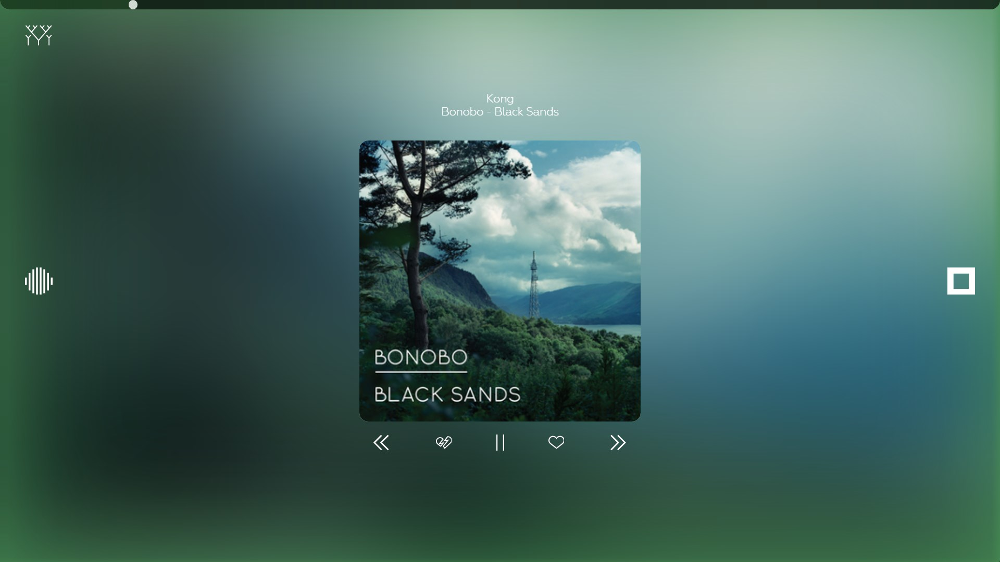

MESH - *Discover Music*
=======================



What is Mesh?
-------------

+ Mesh is a free, Open Source program for streaming music.
+ It contains personal radio functionality (like Pandora, Rdio, etc) as well as on-demand music streaming similar to other popular programs such as Grooveshark.
+ All the music on Mesh is completely free, and there are no song, skip, or station limits at all.

Contributing
------------

Pull requests, bug reports, suggestions, and other forms of contribution or feedback are greatly appriciated.

Why Should I Use Mesh?
----------------------

With so many alternative music services, what makes Mesh so much better? I've compiled a list of pros and cons for Mesh below:

|             Pros             |                Cons                |
|:----------------------------:|:----------------------------------:|
| No Ads (not even banner ads) |           Still in Alpha           |
|    Supports many platforms   |        Unpolished interface        |
|   Extensible/Hackable Code   |   Some servers require a Beta Key  |
| You can host your own Server |   May be buggy in some instances   |
|        Unlimited Skips       | No Internet Explorer Compatibility |
|  No monthly limits/song caps |    Currently only one developer    |
|      27-36 Million Songs     |    Varying Quality (Usually HD)    |
|   On-Demand Song Streaming   |                                    |
|            Free!             |                <br>                |

How can I use it?
-----------------

Your either going to need to get a beta key for an existing server or host one yourself. Here's how to do the latter:

1. __Clone the project__: Either run ```git clone https://github.com/taconut/mesh``` or Extract the zip manually. I personally reccomend the using git clone, since you can run ```git pull``` to update when there are changes. 
2. __Install Dependencies__: Mesh also requires [FFMPEG](https://www.ffmpeg.org/), [GraphicsMagick](http://www.graphicsmagick.org/), and, if you're running Windows, [.NET Framework 2.0](http://www.microsoft.com/en-us/download/details.aspx?id=1639). Most online Node.JS services have these preinstalled, so you only need to worry about this if you're working on a local computer.
3. __Install NPM Modules__: Run ```npm install``` and wait for all of Mesh's dependancies to install themselves into node_modules. Most errors should be pretty self-explanitory, but feel free to open an issue if something doesn't work right. I won't judge; I promise.
4. __Rename buildoptions__: Make a copy of buildoptions.sample.env called buildoptions.env. If you're working in a public environment and do not wish to store these options in a file, you can also inject them directly as environment variables. 
5. __Add API Keys__: Below, I've provided a list of places where you can get various API keys needed by Mesh.
  + [The Echonest](https://developer.echonest.com/account/register)
  + [Last.fm](http://www.last.fm/api/account/create)
  + [Youtube](https://developers.google.com/youtube/v3/)
6. __Setup a user database__: For the time being, Mesh only supports mongo. There are plenty of free services for using Mongo databases.
7. __Setup an email service__: For email recovery and verification to work, you're also going to need an email account. Gmail should suffice, but there are other options available if you need them.
8. __Add a Session Secret__: Your going to need a value for SESSION_SECRET. Try to use something that people would have a relatively hard time guessing (so not "secret").
9. __Create an admin account__: The first account you create will have admin privlages. Go to /user/signup to create your admin user. You can leave the "beta key" section blank since there are no beta keys yet .
10. __Add beta keys__: Right now, beta keys are mandatory. You can add them by going to /admin/key/__KEY__. Additionally, you can supply a number of uses and expiry date. Refer to the [Admin Reference Page](../../wiki/Admin) for more information.

How does it work?
-----------------

+ Currently, Mesh retrieves most of its music from YouTube. However, I plan to supplement this with other sources in the near future.  
+ Mesh is heavily reliant on [The Echonest](http://the.echonest.com) to build a profile of your taste in music. In future versions of Mesh, more of this work will be done locally.
+ I'm using [Last.fm's API](http://www.last.fm/api) to retrieve the album art, since that seems to have by far the most amount of content available

What Platforms does it support?
-------------------------------

+ Chrome
+ Firefox
+ Safari*
+ Android*
+ iOS*
+ Squeezebox*
+ Windows**
+ Mac**
+ Linux**

<sup><sub>
  \*Currently in Development  
  \*\*Planned  
</sub></sup>
